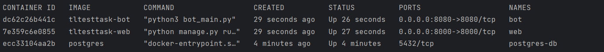

## Django + DRF + aiogram + Docker 

#### Запуск проекта локально через docker:
1. В файле docker-compose.yml заменить переменные API_KEY и TOKEN 
на api-key, полученный через яндекс, и токен для работы с ботом 
соответственно

2. В терминале выполнить команду
    ```
    docker-compose up -d --build web
    ```
    для сборки и фонового запуска контейнеров

3. Для проверки можно выполнить ```docker ps``` - должны быть запущены
 три контейнера


#### Настройка Django:
1. Выполнить команду
    ```
    docker exec -it <id> bash
    ```
    где id - CONTAINER ID сервиса web
2. Создать superuser для доступа к админке
    ```
    python manage.py createsuperuser
    ```
3. Прогнать миграции
    ```
    python manage.py migrate
    ```
4. Заполнить базу данными
    ```
    python manage.py add_cities
    ```
    Будут созданы города из списка cities.txt с проставленными координатам

---

После запуска админка будет доступна по адресу `http://localhost:8000/admin/`

Чтобы узнать погоду в браузере, нужно перейти 
по `http://localhost:8000/weather?city=<Название города>`

Чтобы узнать погоду в боте, нужно отправить название города

---

#### Для запуска тестов

Выполнить команду
    ```
    docker-compose up tests
    ```